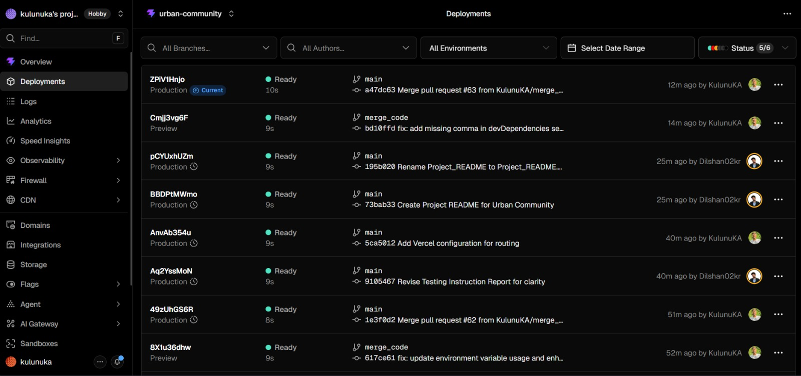
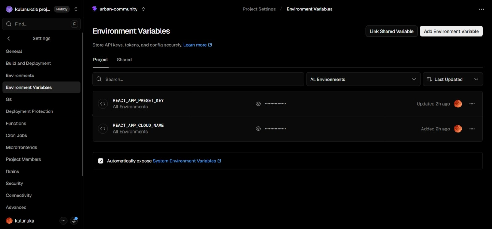
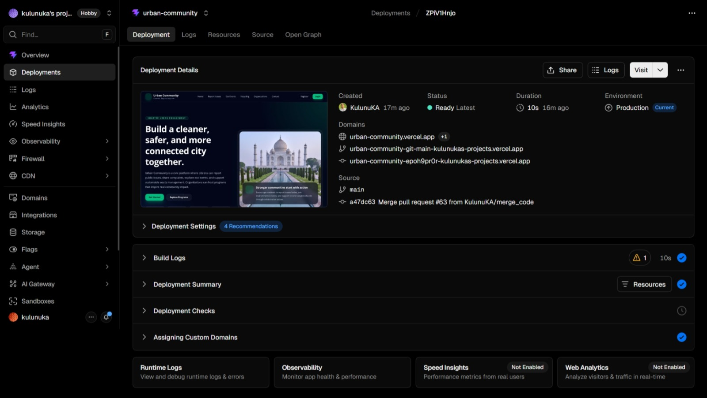
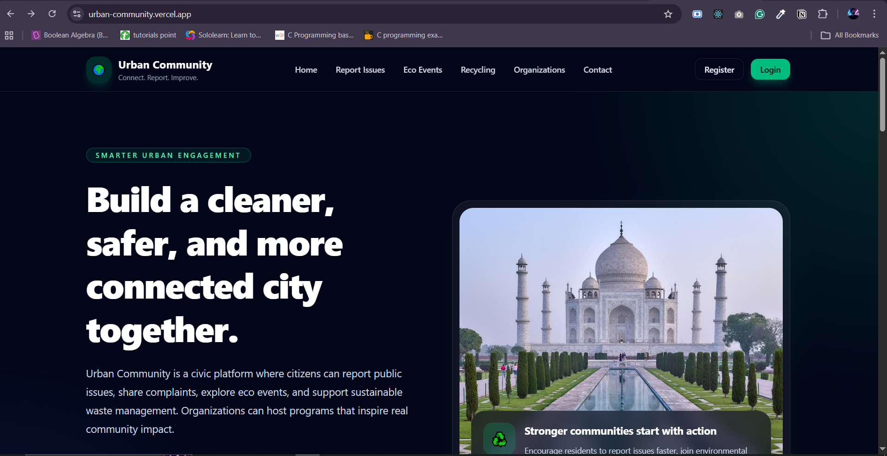

# Deployment documentation — Urban Community

**Classification:** Public-SLIIT  

This document describes how the **Urban Community** project is deployed to production-like environments: the **backend** on **Railway** and the **frontend** on **Vercel**. Replace all **placeholder URLs** with your team’s live links when you submit.

---

## Live deployment URLs

| Service | Placeholder (replace with your live URL) |
|---------|--------------------------------------------|
| **Deployed backend API** | `https://YOUR-BACKEND.railway.app` |
| **Deployed frontend application** | `(https://urban-community.vercel.app/)` |

**Your live links (edit this table):**

| Service | URL |
|---------|-----|
| Backend API | _e.g. `https://urban-community-api-production.up.railway.app`_ |
| Frontend app | _e.g. `https://urban-community.vercel.app`_ |

---

## Environment variables (names only — do not commit secrets)

Configure these in **Railway** (backend service) and **Vercel** (frontend project). Use strong random values for secrets; never paste real secrets into this README or into public screenshots.

### Backend (Railway) — `server/`

| Variable | Required | Purpose |
|----------|------------|---------|
| `JWT_SECRET` | Yes | Secret for signing JWTs. |
| `MONGO_URI` | Yes | MongoDB connection string (e.g. Atlas or Railway Mongo plugin). |
| `PORT` | Optional | HTTP port; Railway often sets `PORT` automatically—use it if your app reads `process.env.PORT`. |
| `NODE_ENV` | Recommended | Set to `production` for production. |
| `CLOUDINARY_CLOUD_NAME` | Yes (if uploads used) | Cloudinary cloud name. |
| `CLOUDINARY_API_KEY` | Yes (if uploads used) | Cloudinary API key. |
| `CLOUDINARY_API_SECRET` | Yes (if uploads used) | Cloudinary API secret. |

Optional (only if your branch uses them): CORS-related vars, email keys, etc.—mirror whatever exists in **`server/.env`** locally.

### Frontend (Vercel) — `frontend/`

| Variable | Required | Purpose |
|----------|------------|---------|
| `VITE_API_URL` | Often yes in production | Public base URL of the **Railway** API (no trailing slash), e.g. `https://YOUR-BACKEND.railway.app`. Your code must read this when building API requests (if you use a central axios/fetch base URL). |

If your frontend calls **`/api`** on the same origin only in dev, production builds on Vercel must point explicitly to the Railway host unless you add a **Vercel rewrite** to proxy `/api` to Railway.

---

## Backend deployment — Railway

### Platform

**Railway** — [https://railway.app](https://railway.app)

### High-level steps

1. **Create a Railway account** and a **new project** (e.g. “Deploy from GitHub repo”).
2. **Connect** your GitHub repository and select the **Urban Community** repo and branch you want to deploy.
3. **Add a service** that runs the Node API from the **`server/`** directory (monorepo):
   - Set **Root Directory** / **Service directory** to **`server`** (or equivalent in the Railway UI).
   - **Install command:** `npm install` (default is often fine).
   - **Start command:** `npm start` (runs `node index.js` per `server/package.json`).
4. **Provision MongoDB** (choose one):
   - **MongoDB Atlas** — create a cluster, user, and network access; copy **`MONGO_URI`** into Railway variables; or  
   - **Railway MongoDB** template / plugin — copy the provided connection string into **`MONGO_URI`**.
5. **Set environment variables** in Railway for the service (see table above). Do **not** commit `.env` to git.
6. **Generate a public domain** for the service (Railway **Settings → Networking → Generate Domain**). That URL is your **deployed backend API** base (use it in Vercel as `VITE_API_URL` if applicable).
7. **Redeploy** after changing variables. Check **Deploy logs** for `MongoDB Connected!` and `Server running on port …`.

### Notes

- Ensure **`JWT_SECRET`** is set in Railway; `server/index.js` exits if it is missing.
- If the app binds to `process.env.PORT`, Railway injects **`PORT`**—keep your code using that value for `listen`.
- For **CORS**, allow your **Vercel** frontend origin in server CORS configuration if browsers block cross-origin requests.

---

## Frontend deployment — Vercel

### Platform

**Vercel** — [https://vercel.com](https://vercel.com)

### High-level steps

1. **Create a Vercel account** and **Import** the same GitHub repository.
2. **Configure the project:**
   - **Root Directory:** **`frontend`**
   - **Framework Preset:** **Vite**
   - **Build Command:** `npm run build` (default for Vite)
   - **Output Directory:** `dist`
3. **Environment variables:** add **`VITE_API_URL`** (or whatever your branch expects) with the **Railway public API URL** (no path suffix unless your code expects it).
4. **Deploy.** Vercel builds on each push to the linked branch (unless you change Git integration settings).
5. Copy the **Production URL** from the Vercel dashboard—that is your **deployed frontend application** link.

### Notes

- Vite only exposes variables prefixed with **`VITE_`** to client code.
- After changing env vars on Vercel, trigger a **redeploy** so the new values are baked into the build.

---

## Deployment evidence (screenshots)

Store images under **`docs/deployment-screenshots/`** and keep this section updated with the same filenames (or adjust the paths below).

**Suggested files to add:**

| File | What it should show |
|------|----------------------|
| `railway-project.png` | Railway project with backend service. |
| `railway-variables.png` | Variable **names** in Railway (blur or crop out values). |
| `railway-deploy-logs.png` | Successful deploy / server listening. |
| `vercel-project.png` | Vercel project overview / linked repo. |
| `vercel-env.png` | Vercel env screen (names only). |
| `vercel-deployment-success.png` | Successful production deployment. |
| `frontend-live.png` | Browser on deployed frontend URL. |
| `backend-health-or-api.png` | Browser or API client hitting a public backend route (e.g. login or a simple GET if available). |

### Screenshots (add PNG/JPEG files under `docs/deployment-screenshots/`)

The paths below are relative to **`docs/DEPLOYMENT.md`**. After you drop in the files listed in the table, the images render in GitHub and most Markdown viewers. Until then, previews may show as missing—that is normal.

  
  
  
  
  
  
  

---

## Checklist before submission

- [ ] Railway backend URL updated in this doc and working over **HTTPS**.
- [ ] Vercel frontend URL updated and loads without console errors.
- [ ] All required env vars set on Railway and Vercel (no secrets in git).
- [ ] CORS / API base URL verified from the **deployed** frontend to the **deployed** backend.
- [ ] Screenshots added under **`docs/deployment-screenshots/`** and linked above.

---

*For local setup and API details, see `docs/PROJECT_README.md`. Classification: **Public-SLIIT**.*
